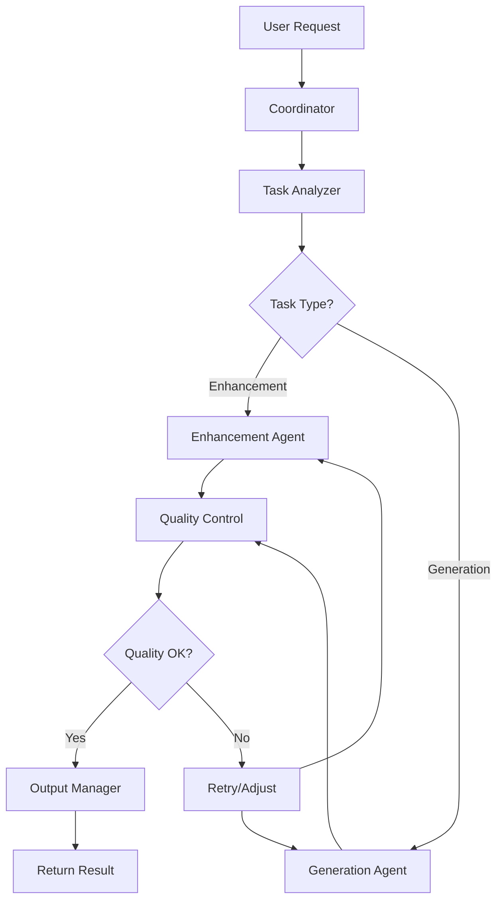

# Deep Vision - System Architecture

## 🏛️ Architectural Overview

This document provides a detailed technical architecture of the Deep Vision multi-agent system.

## System Design Principles

1. **Modularity**: Each agent is independent and can be replaced or upgraded
2. **Scalability**: Can handle multiple concurrent requests through async processing
3. **Efficiency**: Optimized for limited GPU resources
4. **Extensibility**: Easy to add new agents or capabilities
5. **Reliability**: Built-in error handling and retry mechanisms

## Component Architecture

### 1. API Layer (FastAPI)

```
┌─────────────────────────────────────┐
│         API Gateway (FastAPI)        │
├─────────────────────────────────────┤
│  - Authentication Middleware         │
│  - Rate Limiting                     │
│  - Request Validation                │
│  - Error Handling                    │
└─────────────────────────────────────┘
         │              │
         ▼              ▼
   ┌─────────┐    ┌─────────┐
   │ Enhance │    │Generate │
   │  Route  │    │  Route  │
   └─────────┘    └─────────┘
```

**Endpoints:**
- `POST /api/v1/enhance` - Image enhancement tasks
- `POST /api/v1/generate` - Image generation from prompts
- `GET /api/v1/status/{task_id}` - Check task status
- `GET /api/v1/result/{task_id}` - Retrieve results
- `GET /api/v1/health` - Health check

### 2. Multi-Agent System (LangGraph)

```
┌───────────────────────────────────────────────────────┐
│                  Coordinator Agent                     │
│  - Receives requests from API                          │
│  - Manages workflow state                              │
│  - Orchestrates other agents                           │
└───────────────────┬───────────────────────────────────┘
                    │
                    ▼
┌───────────────────────────────────────────────────────┐
│              Task Analyzer Agent                       │
│  - Parses user intent                                  │
│  - Determines required agents                          │
│  - Extracts parameters                                 │
└───────────────────┬───────────────────────────────────┘
                    │
        ┌───────────┴───────────┬──────────────┐
        ▼                       ▼              ▼
┌───────────────┐    ┌──────────────┐   ┌──────────────┐
│  Enhancement  │    │  Generation  │   │   Quality    │
│     Agent     │    │    Agent     │   │    Control   │
└───────────────┘    └──────────────┘   └──────────────┘
        │                    │                  │
        ▼                    ▼                  ▼
   Specialists          Specialists        Validation
```

#### Agent Communication Flow



### 3. Model Inference Layer

```
┌─────────────────────────────────────────┐
│         Model Manager                    │
│  - Model loading/unloading               │
│  - Memory management                     │
│  - Caching                               │
└──────────────┬──────────────────────────┘
               │
    ┌──────────┼──────────┬───────────┐
    ▼          ▼          ▼           ▼
┌────────┐ ┌────────┐ ┌────────┐ ┌────────┐
│ Local  │ │  API   │ │ ONNX   │ │ Torch  │
│ Models │ │Wrapper │ │Runtime │ │ Model  │
└────────┘ └────────┘ └────────┘ └────────┘
```

**Model Strategy:**

1. **Hybrid Approach**:
   - Lightweight models run locally
   - Heavy models via API calls
   - Smart routing based on load

2. **Memory Management**:
   ```python
   if gpu_memory_available() < threshold:
       unload_unused_models()
   if model_not_loaded:
       load_model_async()
   ```

3. **Optimization Techniques**:
   - Model quantization (INT8/FP16)
   - Batch processing
   - Attention slicing
   - CPU offloading for preprocessing

### 4. State Management

```python
class WorkflowState(TypedDict):
    task_id: str
    user_request: str
    task_type: str
    image_data: bytes
    parameters: Dict[str, Any]
    intermediate_results: List[Any]
    current_agent: str
    status: str  # pending, processing, completed, failed
    error: Optional[str]
    retry_count: int
    result: Optional[bytes]
```

### 5. Storage & Caching

```
┌─────────────────────────────────┐
│      Storage Layer               │
├─────────────────────────────────┤
│  File System (Local)             │
│  ├── uploads/  (temp input)      │
│  ├── outputs/  (results)         │
│  ├── models/   (weights)         │
│  └── cache/    (processed)       │
├─────────────────────────────────┤
│  Optional: S3/MinIO (Production) │
└─────────────────────────────────┘
```

## Agent Detailed Design

### 1. Coordinator Agent

**Responsibilities:**
- Entry point for all tasks
- State initialization and management
- Agent orchestration
- Error handling and recovery

**Implementation:**
```python
class CoordinatorAgent:
    async def coordinate(self, state: WorkflowState) -> WorkflowState:
        # Initialize workflow
        state = await self.initialize_state(state)
        
        # Route to Task Analyzer
        state = await self.task_analyzer.analyze(state)
        
        # Execute appropriate workflow
        if state.task_type == "enhancement":
            state = await self.enhancement_workflow(state)
        elif state.task_type == "generation":
            state = await self.generation_workflow(state)
        
        # Quality control
        state = await self.quality_control.validate(state)
        
        return state
```

### 2. Task Analyzer Agent

**Responsibilities:**
- Parse natural language requests
- Extract parameters (brightness, style, objects to remove, etc.)
- Determine required specialist agents
- Set processing priorities

**LLM Prompt Template:**
```
You are a task analyzer for an image processing system.
Analyze the user request and extract:
1. Task type (deblur, inpaint, beauty_enhance, generate)
2. Parameters (e.g., target objects, enhancement level)
3. Priority (high, medium, low)
4. Required agents

User request: {user_request}
Image metadata: {image_info}
```

### 3. Enhancement Agent

**Sub-agents:**

#### 3.1 Deblur Specialist
- Model: NAFNet or similar
- Input: Blurry image
- Output: Sharpened image

#### 3.2 Inpainting Specialist
- Model: LaMa or SD-Inpaint
- Input: Image + mask (auto-generated or user-provided)
- Output: Image with objects removed

#### 3.3 Beauty Enhancement Specialist
- Face detection → GFPGAN/CodeFormer
- Skin smoothing → Custom filters
- Body reshaping → Keypoint detection + warping

### 4. Generation Agent

**Sub-agents:**

#### 4.1 Prompt Optimizer
- Enhances user prompts for better results
- Adds quality tags, style modifiers
- Uses LLM to expand brief prompts

#### 4.2 Generation Specialist
- Model: Stable Diffusion (via API or local)
- Implements optimization strategies:
  ```python
  pipeline.enable_attention_slicing()
  pipeline.enable_vae_tiling()
  pipeline.enable_xformers_memory_efficient_attention()
  ```

### 5. Quality Control Agent

**Validation Criteria:**
- Resolution check
- Artifact detection
- Content consistency
- Output quality score

**Actions:**
- Accept: Pass to Output Manager
- Reject: Trigger retry with adjusted parameters
- Escalate: Flag for manual review

## Data Flow

### Enhancement Request Flow

```
1. User uploads image + describes task
   ↓
2. API validates and creates task_id
   ↓
3. Coordinator receives task
   ↓
4. Task Analyzer determines: "inpaint" + extracts "remove person"
   ↓
5. Enhancement Agent → Inpainting Specialist
   ↓
6. Specialist calls model inference
   ↓
7. Quality Control validates result
   ↓
8. Output Manager saves and returns result
```

### Generation Request Flow

```
1. User provides text prompt
   ↓
2. API validates and creates task_id
   ↓
3. Coordinator receives task
   ↓
4. Task Analyzer confirms: "generate"
   ↓
5. Generation Agent → Prompt Optimizer
   ↓
6. Optimized prompt → Generation Specialist
   ↓
7. SD model generates image
   ↓
8. Quality Control validates
   ↓
9. Output Manager returns result
```

## Performance Optimization

### 1. Async Processing
```python
@app.post("/api/v1/enhance")
async def enhance_image(file: UploadFile):
    task_id = create_task_id()
    asyncio.create_task(process_enhancement(task_id, file))
    return {"task_id": task_id, "status": "processing"}
```

### 2. Model Loading Strategy
```python
class ModelManager:
    def __init__(self):
        self.loaded_models = {}
        self.model_last_used = {}
        
    async def get_model(self, model_name: str):
        if model_name not in self.loaded_models:
            await self.load_model(model_name)
        self.model_last_used[model_name] = time.time()
        return self.loaded_models[model_name]
    
    async def cleanup_unused_models(self):
        # Unload models not used in last 10 minutes
        for model_name, last_used in self.model_last_used.items():
            if time.time() - last_used > 600:
                self.unload_model(model_name)
```

### 3. Request Queue
```python
from asyncio import Queue, Semaphore

class TaskQueue:
    def __init__(self, max_concurrent: int = 3):
        self.queue = Queue()
        self.semaphore = Semaphore(max_concurrent)
    
    async def process_task(self, task):
        async with self.semaphore:
            return await execute_task(task)
```

## Scalability Considerations

### Horizontal Scaling
1. **Stateless API**: Use Redis for shared state
2. **Load Balancer**: Distribute requests across multiple workers
3. **Model Server**: Separate model inference service (e.g., TorchServe)

### Vertical Scaling
1. **GPU Pooling**: Share GPU across multiple workers
2. **Model Parallelism**: Split large models across GPUs
3. **Batch Processing**: Group similar requests

## Monitoring & Observability

### Metrics to Track
- Request latency per endpoint
- Model inference time
- GPU utilization
- Memory usage
- Error rates
- Queue depth

### Logging Strategy
```python
from loguru import logger

logger.add(
    "logs/app_{time}.log",
    rotation="500 MB",
    retention="10 days",
    level="INFO"
)
```

## Security Considerations

1. **Input Validation**: Size limits, format checks
2. **Rate Limiting**: Prevent abuse
3. **API Keys**: Secure external API credentials
4. **File Scanning**: Check for malicious content
5. **Output Sanitization**: Ensure no sensitive data in outputs

## Future Enhancements

1. **Multi-GPU Support**: Distribute models across GPUs
2. **WebSocket Support**: Real-time progress updates
3. **Batch API**: Process multiple images efficiently
4. **Model Fine-tuning**: Custom models for specific use cases
5. **A/B Testing**: Compare different models/parameters
6. **User Preferences**: Learn from user feedback

## References

- [LangGraph Documentation](https://python.langchain.com/docs/langgraph)
- [FastAPI Best Practices](https://fastapi.tiangolo.com/advanced/)
- [Diffusers Optimization Guide](https://huggingface.co/docs/diffusers/optimization/fp16)
- [ONNX Runtime Performance Tuning](https://onnxruntime.ai/docs/performance/)
